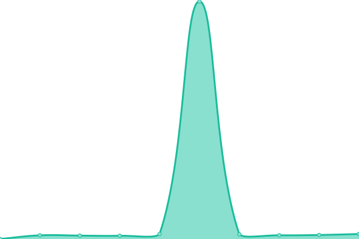

# [📈 Live Status](https://status.wyattduber.com): <!--live status--> **🟧 Partial outage**

This repository contains the open-source uptime monitor and status page for [DoubleYouCash](https://status.wyattduber.com), powered by [Upptime](https://github.com/upptime/upptime).

With [Upptime](https://upptime.js.org), you can get your own unlimited and free uptime monitor and status page, powered entirely by a GitHub repository. We use [Issues](https://github.com/DoubleYouCash/statuspage/issues) as incident reports, [Actions](https://github.com/DoubleYouCash/statuspage/actions) as uptime monitors, and [Pages](https://status.wyattduber.com) for the status page.

<!--start: status pages-->
<!-- This summary is generated by Upptime (https://github.com/upptime/upptime) -->
<!-- Do not edit this manually, your changes will be overwritten -->
<!-- prettier-ignore -->
| URL | Status | History | Response Time | Uptime |
| --- | ------ | ------- | ------------- | ------ |
|  [Personal Website](https://www.wyattduber.com) | 🟩 Up | [personal-website.yml](https://github.com/wyattduber/statuspage/commits/HEAD/history/personal-website.yml) | 

 198ms
     
 | 

<a href="https://status.wyattduber.com/history/personal-website">100.00%</a>
    

|  [Resume](https://resume.wyattduber.com) | 🟥 Down | [resume.yml](https://github.com/wyattduber/statuspage/commits/HEAD/history/resume.yml) | 

 225ms
     
 | 

<a href="https://status.wyattduber.com/history/resume">59.00%</a>
    

|  [Wedding](https://wedding.wyattduber.com) | 🟥 Down | [wedding.yml](https://github.com/wyattduber/statuspage/commits/HEAD/history/wedding.yml) | 

 288ms
     
 | 

<a href="https://status.wyattduber.com/history/wedding">59.00%</a>
    

|  [Nextcloud](https://cloud.wyattduber.com) | 🟩 Up | [nextcloud.yml](https://github.com/wyattduber/statuspage/commits/HEAD/history/nextcloud.yml) | 

 1292ms
     
 | 

<a href="https://status.wyattduber.com/history/nextcloud">100.00%</a>
    

|  [iTrakz](https://itrakz.wyattduber.com) | 🟥 Down | [i-trakz.yml](https://github.com/wyattduber/statuspage/commits/HEAD/history/i-trakz.yml) | 

 225ms
     
 | 

<a href="https://status.wyattduber.com/history/i-trakz">66.16%</a>
    

|  [SearXNG](https://search.wyattduber.com) | 🟥 Down | [sear-xng.yml](https://github.com/wyattduber/statuspage/commits/HEAD/history/sear-xng.yml) | 

 187ms
     
 | 

<a href="https://status.wyattduber.com/history/sear-xng">59.00%</a>
    

|  [Memos](https://memos.wyattduber.com) | 🟥 Down | [memos.yml](https://github.com/wyattduber/statuspage/commits/HEAD/history/memos.yml) | 

 235ms
     
 | 

<a href="https://status.wyattduber.com/history/memos">0.00%</a>
    

|  [Paste](https://paste.wyattduber.com) | 🟩 Up | [paste.yml](https://github.com/wyattduber/statuspage/commits/HEAD/history/paste.yml) | 

 182ms
     
 | 

<a href="https://status.wyattduber.com/history/paste">100.00%</a>
    

|  [Repo](https://repo.wyattduber.com) | 🟩 Up | [repo.yml](https://github.com/wyattduber/statuspage/commits/HEAD/history/repo.yml) | 

 199ms
     
 | 

<a href="https://status.wyattduber.com/history/repo">100.00%</a>
    

|  [AMP](https://server.wyattduber.com) | 🟩 Up | [amp.yml](https://github.com/wyattduber/statuspage/commits/HEAD/history/amp.yml) | 

 218ms
     
 | 

<a href="https://status.wyattduber.com/history/amp">100.00%</a>
    

|  [EMP AMP](https://server.endofthemapparty.com) | 🟩 Up | [emp-amp.yml](https://github.com/wyattduber/statuspage/commits/HEAD/history/emp-amp.yml) | 

 251ms
     
 | 

<a href="https://status.wyattduber.com/history/emp-amp">100.00%</a>
    

<!--end: status pages-->

[**Visit our status website →**](https://status.wyattduber.com)

## 📄 License

- Powered by: [Upptime](https://github.com/upptime/upptime)
- Code: [MIT](./LICENSE) © [DoubleYouCash](https://status.wyattduber.com)
- Data in the `./history` directory: [Open Database License](https://opendatacommons.org/licenses/odbl/1-0/)
