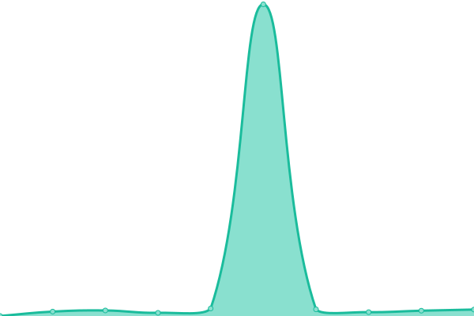

# [📈 Live Status](https://status.wyattduber.com): <!--live status--> **🟧 Partial outage**

This repository contains the open-source uptime monitor and status page for [DoubleYouCash](https://status.wyattduber.com), powered by [Upptime](https://github.com/upptime/upptime).

With [Upptime](https://upptime.js.org), you can get your own unlimited and free uptime monitor and status page, powered entirely by a GitHub repository. We use [Issues](https://github.com/DoubleYouCash/statuspage/issues) as incident reports, [Actions](https://github.com/DoubleYouCash/statuspage/actions) as uptime monitors, and [Pages](https://status.wyattduber.com) for the status page.

<!--start: status pages-->
<!-- This summary is generated by Upptime (https://github.com/upptime/upptime) -->
<!-- Do not edit this manually, your changes will be overwritten -->
<!-- prettier-ignore -->
| URL | Status | History | Response Time | Uptime |
| --- | ------ | ------- | ------------- | ------ |
|  [Personal Website](https://www.wyattduber.com) | 🟩 Up | [personal-website.yml](https://github.com/wyattduber/statuspage/commits/HEAD/history/personal-website.yml) | 

 320ms
     
 | 

<a href="https://status.wyattduber.com/history/personal-website">99.73%</a>
    

|  [Resume](https://resume.wyattduber.com) | 🟩 Up | [resume.yml](https://github.com/wyattduber/statuspage/commits/HEAD/history/resume.yml) | 

 222ms
     
 | 

<a href="https://status.wyattduber.com/history/resume">99.74%</a>
    

|  [Wedding](https://wedding.wyattduber.com) | 🟩 Up | [wedding.yml](https://github.com/wyattduber/statuspage/commits/HEAD/history/wedding.yml) | 

 354ms
     
 | 

<a href="https://status.wyattduber.com/history/wedding">99.47%</a>
    

|  [Nextcloud](https://cloud.wyattduber.com) | 🟥 Down | [nextcloud.yml](https://github.com/wyattduber/statuspage/commits/HEAD/history/nextcloud.yml) | 

 999ms
     
 | 

<a href="https://status.wyattduber.com/history/nextcloud">99.65%</a>
    

|  [iTrakz](https://itrakz.wyattduber.com) | 🟩 Up | [i-trakz.yml](https://github.com/wyattduber/statuspage/commits/HEAD/history/i-trakz.yml) | 

 370ms
     
 | 

<a href="https://status.wyattduber.com/history/i-trakz">99.79%</a>
    

|  [SearXNG](https://search.wyattduber.com) | 🟩 Up | [sear-xng.yml](https://github.com/wyattduber/statuspage/commits/HEAD/history/sear-xng.yml) | 

 472ms
     
 | 

<a href="https://status.wyattduber.com/history/sear-xng">99.80%</a>
    

|  [Memos](https://memos.wyattduber.com) | 🟩 Up | [memos.yml](https://github.com/wyattduber/statuspage/commits/HEAD/history/memos.yml) | 

 368ms
     
 | 

<a href="https://status.wyattduber.com/history/memos">99.82%</a>
    

|  [Paste](https://paste.wyattduber.com) | 🟩 Up | [paste.yml](https://github.com/wyattduber/statuspage/commits/HEAD/history/paste.yml) | 

 191ms
     
 | 

<a href="https://status.wyattduber.com/history/paste">99.71%</a>
    

|  [Homepage](https://home.wyattduber.com) | 🟥 Down | [homepage.yml](https://github.com/wyattduber/statuspage/commits/HEAD/history/homepage.yml) | 

 192ms
     
 | 

<a href="https://status.wyattduber.com/history/homepage">99.72%</a>
    

|  [Repo](https://repo.wyattduber.com) | 🟩 Up | [repo.yml](https://github.com/wyattduber/statuspage/commits/HEAD/history/repo.yml) | 

 194ms
     
 | 

<a href="https://status.wyattduber.com/history/repo">100.00%</a>
    

|  [AMP](https://server.wyattduber.com) | 🟩 Up | [amp.yml](https://github.com/wyattduber/statuspage/commits/HEAD/history/amp.yml) | 

 849ms
     
 | 

<a href="https://status.wyattduber.com/history/amp">100.00%</a>
    

|  [EMP AMP](https://server.endofthemapparty.com) | 🟩 Up | [emp-amp.yml](https://github.com/wyattduber/statuspage/commits/HEAD/history/emp-amp.yml) | 

 268ms
     
 | 

<a href="https://status.wyattduber.com/history/emp-amp">100.00%</a>
    

<!--end: status pages-->

[**Visit our status website →**](https://status.wyattduber.com)

## 📄 License

- Powered by: [Upptime](https://github.com/upptime/upptime)
- Code: [MIT](./LICENSE) © [DoubleYouCash](https://status.wyattduber.com)
- Data in the `./history` directory: [Open Database License](https://opendatacommons.org/licenses/odbl/1-0/)
